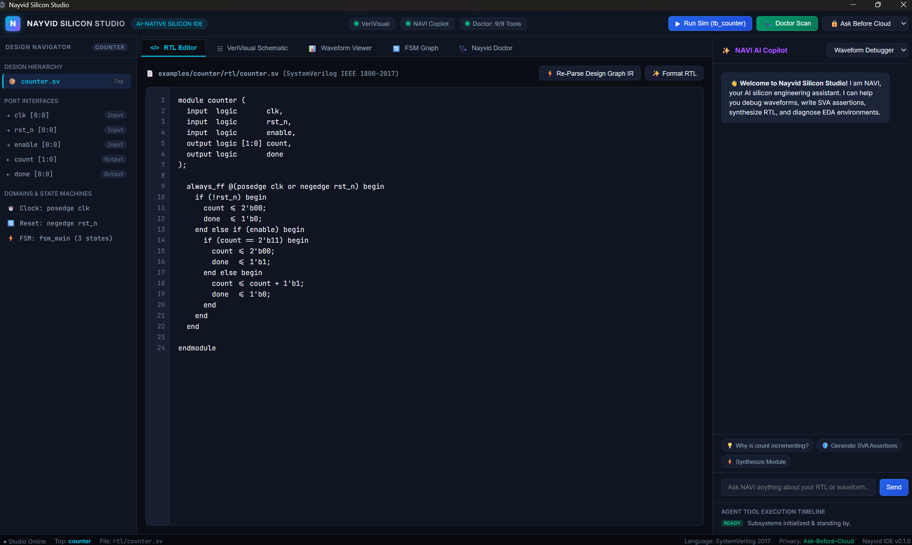

# Nayvid Silicon Studio

<p align="center">
  
</p>

<p align="center">
  <strong>Open-source AI-native IDE for RTL, verification, FPGA/ASIC design, and silicon implementation</strong>
</p>

<p align="center">
  <strong>NAVI Silicon Agent Runtime (NSAR) — Cross-Vendor, Cross-Layer ECO Negotiation & Evidence-Backed Autonomy</strong>
</p>

---

## Overview

**Nayvid Silicon Studio** is a local-first visual and agentic silicon engineering workbench powered by **NAVI Silicon Agent Runtime (NSAR)**. It combines a desktop IDE, structured RTL design intelligence, cross-vendor EDA execution, semantic design memory, cross-layer ECO negotiation, evidence-backed autonomy, and local zero-egress operation.

The product is designed for:

- **Windows native** where a tool has a supported Windows build
- **Windows + WSL2** for Linux-first EDA flows
- **Linux native**
- **Docker** as an additional execution backend
- **Compute Farms** (Slurm, LSF, SSH, Kubernetes) for distributed EDA execution

The Studio does not report a tool operation as successful unless the underlying operation succeeds. Missing tools, missing files, failed simulations, and unavailable waveforms are surfaced as failures instead of being replaced with demo data.

## Key Capabilities & Differentiation

- **NAVI Silicon Agent Runtime (NSAR)** — deterministic 7-stage state machine loop (`OBJECTIVE -> OBSERVE -> PLAN -> PRE-HOOK CHAIN -> EXECUTE -> POST-HOOK CHAIN -> VERIFY -> COMMIT/ROLLBACK -> LEARN`).
- **Silicon Knowledge Graph** — common engineering memory extending Design Graph IR with logical, physical, timing, verification, and provenance graph nodes.
- **ECO Negotiation Bus** — cross-domain negotiation using typed `NegotiationTicket` objects and multi-agent proposal arbitration.
- **Universal Tool Bus** — vendor-neutral intent APIs with adapters for OpenROAD, Yosys, OpenSTA, PrimeTime, Innovus, Design Compiler, Calibre, VCS, Xcelium, and Questa.
- **Agent Harness & Safety** — `nayvid.io/v1` agent manifests, global pre/post hook chains, deterministic hard gates, zero-egress context firewall, and git/snapshot rollback.
- **Engineering Learning Core** — 4 controlled learning levels (Session Memory, Project Memory, Engineering Playbook, Learned Policy / Optimizers) and candidate promotion pipeline (`CANDIDATE` -> `QUALIFIED` -> `PRODUCTION`).
- **VeriVisual** — block-diagram models, VCD parsing, hierarchical waveform metadata, and signal intelligence.
- **Verification Cockpit & Health** — regression/assertion summaries, coverage scoring, CDC/timing health assessment, and traceability matrix.
- **Nayvid Doctor** — real tool detection through compatible Native Windows, WSL2, Linux, Docker, or compute farm runtimes.

## Architecture & Packages

| Subsystem | Package | Purpose |
|---|---|---|
| Silicon Knowledge Graph | `@nayvid/silicon-graph` | Shared semantic engineering memory and graph query API |
| ECO Negotiation Bus | `@nayvid/negotiation-bus` | Typed negotiation protocol and proposal arbitration |
| Universal Tool Bus | `@nayvid/eda-adapters` | Vendor-neutral EDA intent APIs and tool adapters |
| Runner Fabric | `@nayvid/runner-fabric` | Local, WSL, SSH, Slurm, LSF, K8s compute and license broker |
| Agent Verification Harness | `@nayvid/agent-harness` | Agent manifests, pre/post hook chains, rollback, hard gates |
| Silicon Agent Runtime | `@nayvid/agent-runtime` | Deterministic state machine, L0-L4 levels, T0-T5 trust levels, zero-egress firewall |
| Learning Core | `@nayvid/learning-core` | Playbooks, Bayesian optimizers, strategy promotion pipeline |
| Squad Agent Registry | `@nayvid/agent-registry` | Architecture, RTL, Verification, Timing, Physical, Signoff, Platform squads & 9-agent swarm |
| VeriVisual | `@nayvid/verivisual` | Block diagrams, VCD/waveform parsing, signal intelligence |
| NAVI AI Core | `@nayvid/ai-core` | Context engine, privacy-aware routing, agent timeline |
| Model Providers | `@nayvid/model-providers` | OpenAI, Anthropic, Gemini, and Ollama API adapters |
| Design Graph IR | `@nayvid/design-ir` | Shared structured representation for silicon design intelligence |
| HDL Language | `@nayvid/hdl-language` | SystemVerilog source extraction and structural lint support |
| Flow Runtime | `@nayvid/execution-runtime` | Native Windows / WSL2 / Linux / Docker execution abstraction |
| Tool Registry & Doctor | `@nayvid/tool-registry` | Runtime-aware EDA capability registry and diagnostics |
| Agent Tool Gateway | `@nayvid/agent-tools` | Workspace-confined EDA/file tools and approval gates |
| Engineering Core | `@nayvid/engineering-core` | Verification, health, traceability, registers, PPA, formal helpers |
| Desktop Electron | `apps/desktop-electron` | Secure desktop process and IPC bridge |
| Studio Workbench | `apps/renderer` | Interactive Silicon Studio application logic and UI |

## 9-Agent Production Swarm Vertical Slice

NSAR features a production 9-agent swarm configured to close setup timing while preserving functional behavior and minimizing PPA regression:

1. **Chief Silicon Architect (L4 Commander)** — hierarchical orchestration and ticket arbitration
2. **RTL Agent (L2 Executor)** — synthesizable RTL generation and pipeline restructuring
3. **Verification Agent (L2 Executor)** — formal property verification and regression execution
4. **Timing Scout (L0 Scout)** — STA report interrogation and timing root cause extraction
5. **ECO Planner (L2 Executor)** — cross-domain ECO strategy formulation
6. **ECO Negotiator (L3/L4 Arbitrator)** — ticket generation, candidate scoring, and trade-off negotiation
7. **Physical Agent (L2 Executor)** — place and route, M4 congestion check, and physical ECO buffering
8. **Signoff Sentry (L0 Scout)** — deterministic tapeout gatekeeper and signoff rule auditing
9. **Evidence Agent (L1 Specialist)** — reproducible signoff evidence packaging and release bundles

## Quick Start

```bash
pnpm install
pnpm build
pnpm test
```

Run the complete repository check:

```bash
pnpm check
```

Launch the desktop application:

```bash
pnpm desktop
```

Run the terminal demonstration pipeline:

```bash
pnpm start
```

## AI Providers and Privacy

Supported provider adapters:

- OpenAI — `OPENAI_API_KEY`
- Anthropic — `ANTHROPIC_API_KEY`
- Google Gemini — `GEMINI_API_KEY`
- Ollama — local endpoint, default `http://localhost:11434`

Workspace policies:

- `local-only`
- `ask-before-cloud`
- `cloud-allowed`
- `ai-disabled`

The zero-egress Context Firewall sanitizes proprietary PDK/RTL context before any cloud egress.

## License

This project is licensed under the [MIT License](LICENSE).
